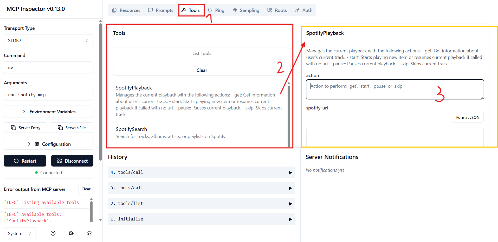
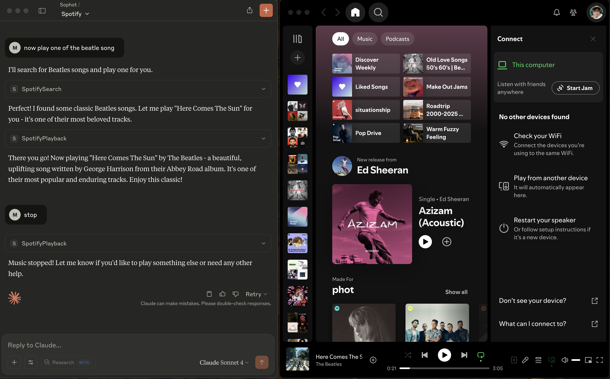

## YouTube MCP Server
**WATCH DEMO: https://youtu.be/fNikzrT-UG4**

MCP project to connect Claude with Spotify. Built on top of [spotipy-dev's API](https://github.com/spotipy-dev/spotipy/tree/2.24.0).
Forked from https://github.com/varunneal/spotify-mcp

**Features**

- Start, pause, and skip playback
- Search for tracks/albums/artists/playlists
- Get info about a track/album/artist/playlist
- Manage the Spotify queue
- Manage, create, and update playlists

**Getting Spotify API Keys**
Create an account on [developer.spotify.com](https://developer.spotify.com/). Navigate to [the dashboard](https://developer.spotify.com/dashboard). 
Create an app with redirect_uri as http://127.0.0.1:8080/callback. 
You can choose any port you want but you must use http and an explicit loopback address (IPv4 or IPv6).

**1. Sync dependencies and update lockfile.**

```bash
$ uv sync
```

<br />

**2. Activate an independent environment to work with.**

```bash
$ source .venv/bin/activate
```

<br />

**3. Testing server**
If `node.js` is not installed, go ahead and install it at https://nodejs.org/en/download.

```bash
$ npx @modelcontextprotocol/inspector uv run spotify-mcp

# You'll see sth like below, head to the url and you can test the available tools, resources, prompts we implemented.
Starting MCP inspector...
⚙️ Proxy server listening on port 6277
🔍 MCP Inspector is up and running at http://127.0.0.1:6274 🚀
```

Output:
1. You can see all the tools that we made and are available.
2. Click on any tool to interactively test it.
3. The tool's required inputs and results can be played with with `Run Tool` button.



<br />
<br />

**4. Integrate with MCP Host (Claude Desktop)**
```json
# Add below instruction to "claude_desktop_config.json"

{
    "mcpServers": {
        "youtube": {
            "command": "uv",
            "args": [
                "--directory",
                "<PROJECT_PATH>/spotify-mcp",
                "run",
                "spotify-mcp"
            ],
            "env": {
                "SPOTIFY_CLIENT_ID": <YOUR_CLIENT_ID>,
                "SPOTIFY_CLIENT_SECRET": <YOUR_CLIENT_SECRET>,
                "SPOTIFY_REDIRECT_URI": "http://127.0.0.1:8080/callback"
            }
        }
    }
}
```

Output 1:
