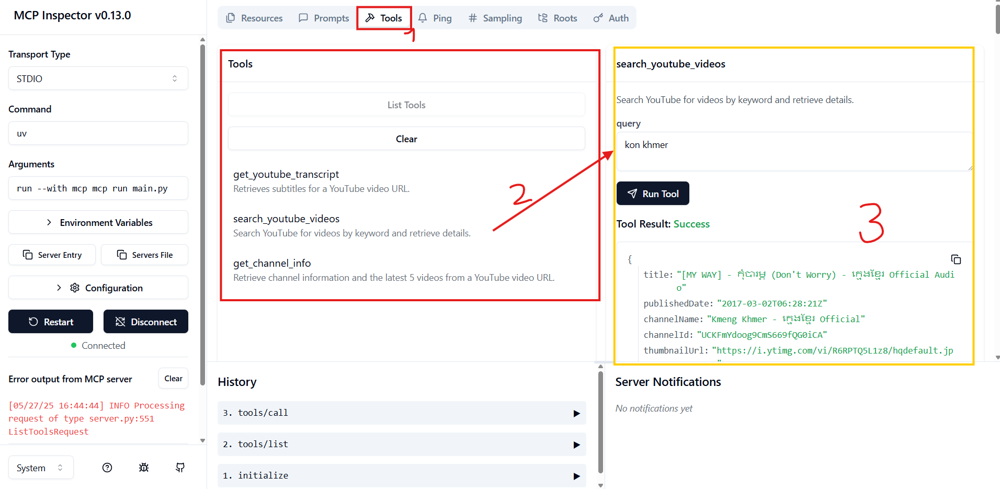
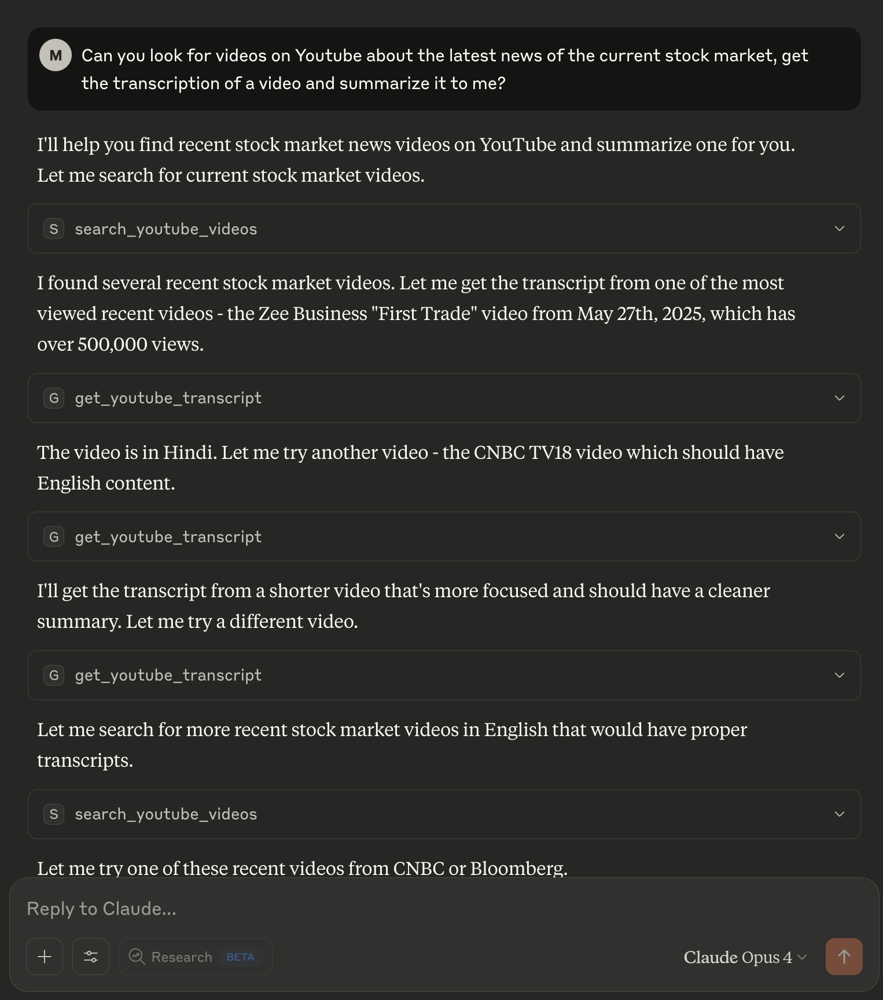
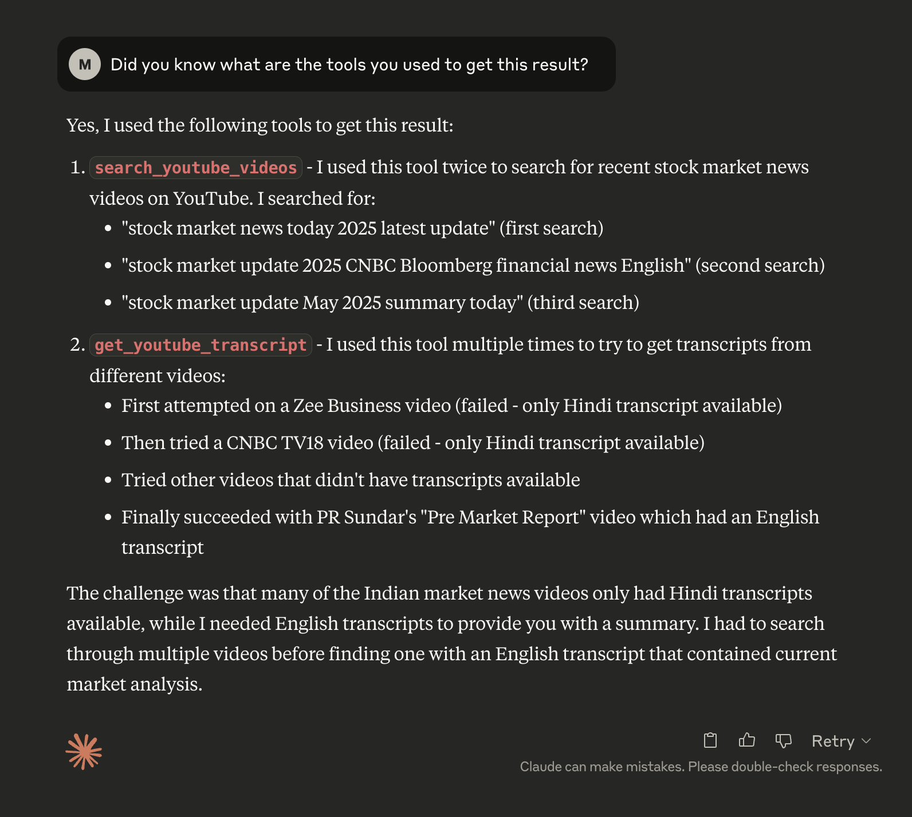

## YouTube MCP Server
**WATCH DEMO: https://youtu.be/9koChFe5tMI**

**1. Sync dependencies and update lockfile.**

```bash
$ uv sync
```

<br />

**2. Activate an independent environment to work with.**

```bash
$ source .venv/bin/activate
```

<br />

**3. Testing server**
If `node.js` is not installed, go ahead and install it at https://nodejs.org/en/download.

```bash
$ mcp dev main.py

# You'll see sth like below, head to the url and you can test the available tools, resources, prompts we implemented.
Starting MCP inspector...
⚙️ Proxy server listening on port 6277
🔍 MCP Inspector is up and running at http://127.0.0.1:6274 🚀
```

Output:
1. You can see all the tools that we made and are available.
2. Click on any tool to interactively test it.
3. The tool's required inputs and results can be played with with `Run Tool` button.



<br />
<br />

**4. Integrate with MCP Host (Claude Desktop)**
```json
# Add below instruction to "claude_desktop_config.json"

{
    "mcpServers": {
        "youtube": {
            "command": "uv",
            "args": [
                "--directory",
                "<PROJECT_PATH>/youtube-mcp-server",
                "run",
                "main.py"
            ],
            "env": {
                "YOUTUBE_API_KEY": <YOUR_YOUTUBE_API_KEY>
            }
        }
    }
}
```

Output 1:


Output 2:
